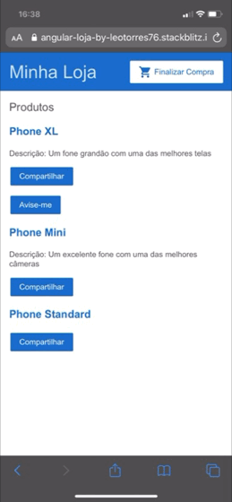

## Angular
Pequeno exemplo de app feito no Angular e suas principais características de utilização

### Template Syntax (e.g)

*ngFor 
*ngIf 
Interpolation {{}} 
Property Binding [] 
Event Binding () 

### Components

### Input & Output

### Routing

### Managing Data

### Forms
